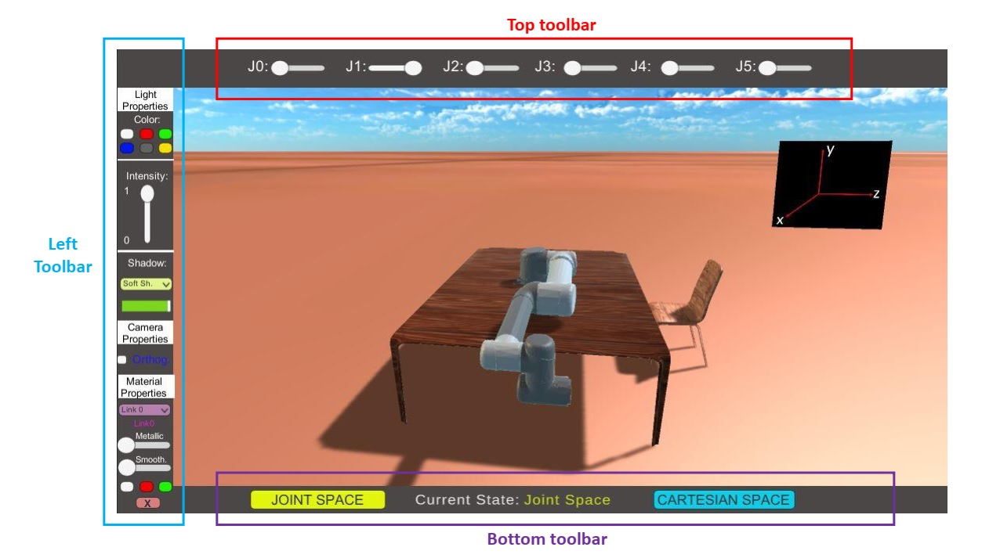

# robot-arm-simulator-unity

A GUI-equipped simulator of 6-DoF robotic arm made in Unity.

The robot currently is a Universal Robots UR5 model, but it can be anything. I am planning to add more robot models in the future.

A simple GUI including many features is given for simple simulation of movement of the end-effector of a 6-DoF robotic arm.

The GUI features moving around the manipulator, zooming in and out, and moving the end-effector to a desired position and orientation.

You can move the end-effector both in Cartesian and joint space. You can also set the lighting, colors, material properties, and many other things.

Please watch the [demo video](DemoVideo_v2.mp4) to get a jist of how the GUI works. You can also see the [Presentation file](Presentation.pdf) for more information.

This project is meant to be a simple exercise/demo in using Unity for designing a GUI for simulating robotic arms.

Moving around is by dragging, and zomming in and out is done by scrolling the mouse wheel. Other GUI functionalities are explained in the demo video.

This project was made in Unity **2019.4.28f1**.

A snapshot of the GUI is shown below:

## Disclaimer

This project was created with the help of Ceyhun Ibolar, cibolar20@ku.edu.tr

## License

This project has an MIT license. See the license file for more information.
